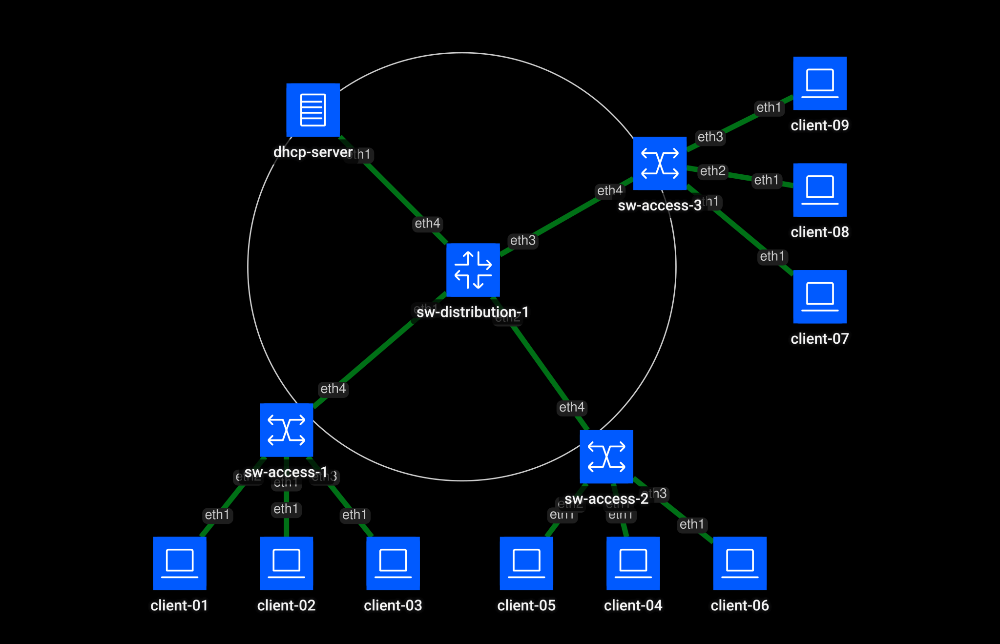

# Containerlab + Ansible: DHCP + Network Automation lab 

This project demonstrates a fully automated, infrastructure-as-code (IaC) deployment of a campus network topology.

The bare-bones infrastructure, comprised of Arista cEOS switches and Alpine Linux DHCP server and clients is deployed quickly using **Containerlab**. Network devices are then configured via **Ansible** playbooks (VLANs, trunks, SVIs, DHCP settings), allowing client endpoints to successfully lease IP addresses from the remote DHCP server.

## Network Topology



**Topology Details:**
* **DHCP Server:** Alpine Linux container running `dnsmasq`, residing on the management VLAN.
* **Distribution Layer:** Arista cEOS switch functioning as the distribution boundary. It hosts the Switch Virtual Interfaces (SVIs) for all client VLANs and utilizes IP helper addresses to relay DHCP traffic to the DHCP server.
* **Access Layer:** Three Arista cEOS switches connected to the distribution switch via 802.1Q trunks.
* **Clients:** Alpine Linux containers connected to access switchports on their respective VLANs. 

## Initial IP and VLAN Schema

| VLAN ID | Name | Subnet|
| :--- | :--- | :--- |
| **10** | Sales | 10.1.1.0/24 |
| **20** | Cameras | 10.1.2.0/24 |
| **30** | Accounting | 10.1.3.0/24 |
| **40** | Guests | 10.1.4.0/24 |
| **99** | Management | 10.1.0.0/24 |

## Technologies & Tools
* **Docker:** Container runtime.
* **Containerlab:** Network emulation and topology orchestration.
* **Ansible:** Configuration management and network automation.
* **Arista cEOS:** Containerized network operating system.
* **Alpine Linux:** Lightweight Linux distribution.

## Quick Start Guide

### Prerequisites
* Linux environment with Docker installed.
* [Containerlab](https://containerlab.dev) installed.
* Ansible installed.

### Deployment Steps

1. **Clone the repository:**
    ```bash
    git clone https://github.com/gabrielsro/remote_dhcp_automation.git
    cd remote_dhcp_automation
    ```

2. **Deploy the Containerlab topology:**
    ```bash
    sudo containerlab deploy -t remote_dhcp_automation.clab.yml
    ```

    *Note: Containerlab will automatically generate a management network on the docker0 subnet to allow Ansible SSH access.*

3. **Run the Ansible Playbook:**
    ```bash
    ansible-playbook site.yml
    ```

4. **Verify DHCP Leases:**

    Connect to one of the Alpine clients and verify it received an IP address from its respective VLAN scope:
    ```bash
    docker exec -it clab-remote_dhcp_automation-client01 ip addr
    ```
    *Note: Clients go from clab-remote_dhcp_automation-client01 to clab-remote_dhcp_automation-client09*

### Cleanup

    To tear down the lab and remove all containers:

    ```bash
    sudo containerlab destroy -t remote_dhcp_automation --cleanup
    ```
